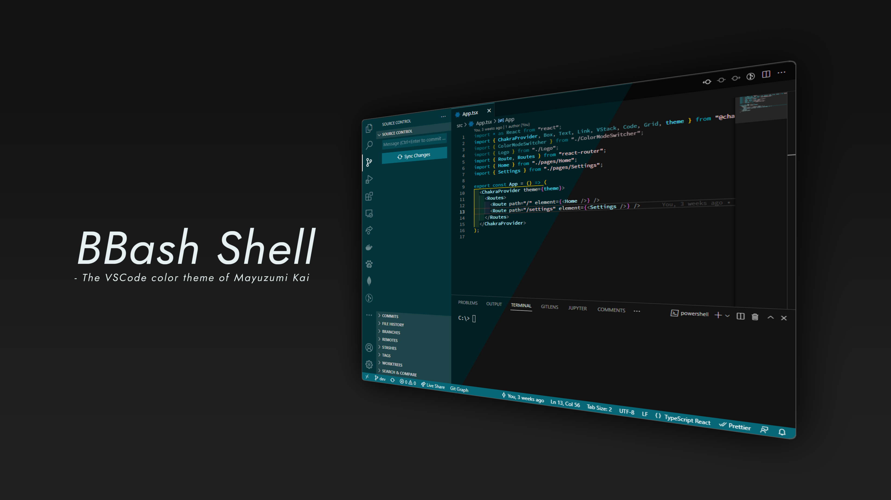

# BBash Shell

The VSCode color theme of <a href="https://www.youtube.com/c/MayuzumiX">Kai Mayuzumi</a>. 
Inspired by <a href="https://github.com/holodata/ancient-one-dark">Ancient One Dark</a>.

## Playground / テーマのプレビュー

[vscode.dev](https://vscode.dev/theme/p-man2976.bbash-shell) で、このテーマの試用ができます。

You can preview this theme on [vscode.dev](https://vscode.dev/theme/p-man2976.bbash-shell) !

## Contribute / このプロジェクトへの貢献

デザイン上の問題等を見つけた場合は、GitHubで[issueを作成](https://github.com/P-man2976/bbash-shell/issues)してお知らせください。  
より視認性を向上させるためのアイディアも歓迎しています。

If you have an idea or find an issue, please [open an issue](https://github.com/P-man2976/bbash-shell/issues) on GitHub and tell me.  
Ideas for more visibility are also welcome.

## Credits & Thanks / クレジット・謝辞

このテーマは [Ancient One Dark](https://github.com/holodata/ancient-one-dark) を参考にさせていただき、作成しました。[uetchy](https://uechi.io/) 様（AODark作者）、すべてのコントリビューターの方々には御礼申し上げます。

This theme is mainly based on [Ancient One Dark](https://github.com/holodata/ancient-one-dark). **Big** thanks for [uetchy](https://uechi.io/) (Author of AODark) and all contributors!

- [Ancient One Dark](https://github.com/holodata/ancient-one-dark)
- [Holodata](https://holodata.org)

## License / ライセンス

このテーマはMITライセンスの下でリリースされています。詳細は [LICENSE.txt](LICENSE.txt) を参照してください。

This theme is released under the MIT License, see [LICENSE.txt](LICENSE.txt) for details.

---

"BBash Shell"はANYCOLOR株式会社のキャラクターを基にした二次創作作品です。  
この作品はANYCOLOR株式会社とは無関係です。

"BBash Shell" is a work of fan fiction based on the character from ANYCOLOR Inc.  
This work is not affiliated with ANYCOLOR Inc.
